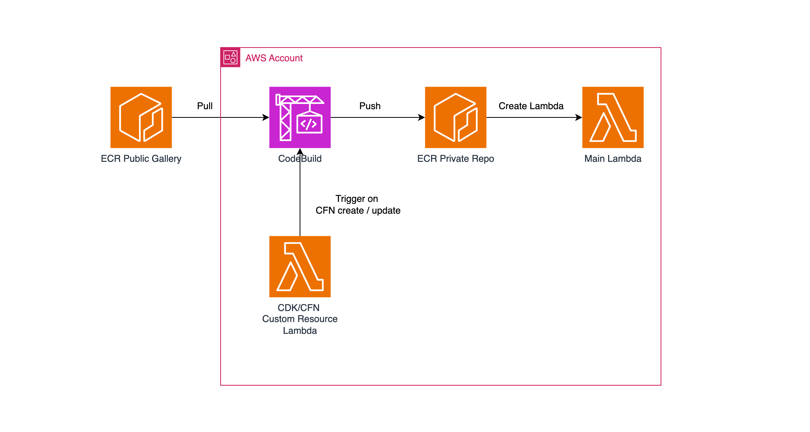

# AWS Lambda Deployment with ECR Public Gallery using CDK & CloudFormation

This repository provides the source code and automation for deploying an AWS Lambda function using an image from the ECR Public Gallery, leveraging AWS CDK and CloudFormation. It automates pulling the image from the public ECR and pushing it to a private ECR repository using CodeBuild and a CloudFormation custom resource.

For a detailed explanation of this process, check out the accompanying blog post: [How to Deploy AWS Lambda with an Image from ECR Public Gallery using CDK & CloudFormation](https://medium.com/@yikaihu121/how-to-deploy-aws-lambda-with-an-image-from-ecr-public-gallery-using-cdk-cloudformation-86cc3ddf6530).

## Architecture Diagram

The architecture for this solution involves pulling an image from the ECR Public Gallery, pushing it to a private ECR repository, and deploying an AWS Lambda function. Below is the high-level architecture diagram:

  

## Prerequisites

Make sure you have the following installed:

- [AWS CLI](https://docs.aws.amazon.com/cli/latest/userguide/install-cliv2.html)
- [AWS CDK](https://docs.aws.amazon.com/cdk/latest/guide/cli.html)
- [Node.js](https://nodejs.org/) (for CDK and npm)

## Getting Started

### Step 1: Install Dependencies

```bash
npm install
```

### Step 2: Deploy the Stack

```bash
npx cdk deploy
```